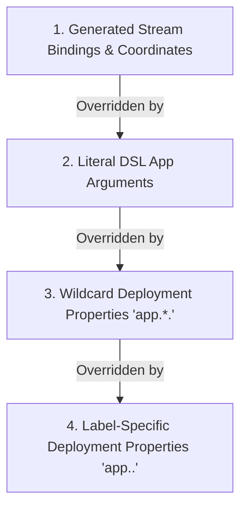

# Stream Deployer: Stream Bindings & Container Arguments Requirements

## 1. Executive Summary & Problem Statement

In Spring Cloud Data Flow (SCDF) and Spring Cloud Skipper, deploying a stream definition (DSL) transforms a high-level messaging topology (such as `time | log`) into individual application specifications equipped with explicit stream binding properties and metadata. These properties configure the underlying Spring Cloud Stream binders (e.g., RabbitMQ, Apache Kafka) at runtime so that microservice containers can:
1. Discover the destinations (exchanges, topics, queues) to which they must publish or subscribe.
2. Form coordinated consumer groups for competing consumer load balancing.
3. Establish required producer groups to ensure downstream queues are bound prior to publishing messages.
4. Identify their stream execution context (stream name, application label, and application type).

In `stream-deployer`, stream definitions are parsed into AST representations (`StreamNode`, `AppNode`, `SourceDestinationNode`, `SinkDestinationNode`). Initially, `StreamDeployerCore` omitted Spring Cloud Stream binding properties and SCDF coordinates when populating application properties. Consequently, `KubernetesResourceGenerator` generated Kubernetes `Deployment` manifests where container `args` was omitted (`null`), preventing containers from establishing stream communication channels.

Recent updates resolve this defect through `StreamBindingResolver`, which computes stream coordinates, binding destinations, consumer groups, and content types. In addition, recent updates introduce `KubernetesPropertyResolver` to configure container environment variables from Kubernetes Secrets and ConfigMaps, `StreamMermaidGenerator` to visualize stream topologies as Mermaid diagrams, and CLI distribution tasks for local installation.

This document specifies the functional and architectural requirements for stream bindings, container arguments, Kubernetes deployment property resolution, and stream topology visualization.

---

## 2. Background: SCDF & Skipper Stream Deployment Mechanics

### 2.1 The Role of Stream Bindings in Spring Cloud Stream

Spring Cloud Stream decouples business logic from messaging middleware through the concept of binder abstractions and logical input/output bindings. By default, applications look for standard binding properties:
- `spring.cloud.stream.bindings.input.destination`: The middleware destination (Kafka topic, RabbitMQ exchange) from which the application consumes.
- `spring.cloud.stream.bindings.input.group`: The consumer group name ensuring point-to-point delivery across scaled instances.
- `spring.cloud.stream.bindings.output.destination`: The middleware destination to which the application produces messages.
- `spring.cloud.stream.bindings.output.producer.requiredGroups`: Comma-separated list of consumer groups for which the binder must pre-provision queues or partitions.

Without these arguments passed via command-line arguments or environment variables, Spring Cloud Stream applications fall back to standalone defaults (such as generating anonymous queues on default destinations), failing to connect to the stream pipeline.

### 2.2 SCDF and Skipper Implementation Analysis

An analysis of `spring-cloud-dataflow` (`spring-cloud-dataflow-core`, `spring-cloud-dataflow-server-core`) and `spring-cloud-skipper` (`spring-cloud-skipper-server-core`) reveals the exact pipeline through which bindings are constructed:

1. **`StreamApplicationDefinitionBuilder` (SCDF Core)**:
   - Takes a `StreamNode` and stream name.
   - Computes application role (`source`, `processor`, `sink`, `app`) based on position and adjacent destination channels.
   - Populates stream coordinate metadata:
     - `spring.cloud.dataflow.stream.name`: The stream name.
     - `spring.cloud.dataflow.stream.app.label`: The unique label of the app in the stream.
     - `spring.cloud.dataflow.stream.app.type`: The calculated application role.
   - Connects adjacent pipeline apps using canonical channel naming: `<streamName>.<upstreamLabel>`.
   - Sets `requiredGroups` on producers to guarantee downstream persistence.
   - Handles named destination channels (`:DEST > app` and `app > :DEST`).
   - Translates DSL content-type arguments (`inputType`, `outputType`).

2. **`SkipperStreamDeployer` & `AppDeploymentRequestFactory` (Skipper Core)**:
   - Aggregates stream application definitions with deployment properties.
   - Resolves deployment properties categorized by wildcard (`app.*.`) and label-specific (`app.<label>.`) keys.
   - Produces `SpringCloudDeployerApplicationSpec` manifests containing application configuration maps.

3. **`KubernetesAppDeployer` & `DefaultContainerFactory` (Spring Cloud Deployer Kubernetes)**:
   - Converts the merged application properties into command-line arguments formatted as `--<key>=<value>`.
   - Injects these arguments into the container specification of the generated Kubernetes `Deployment`.

### 2.3 Kubernetes Deployment Properties and Configuration Mechanics

In SCDF and Skipper, applications require deployment properties to configure the target runtime platform. For Kubernetes deployments, Spring Cloud Deployer Kubernetes maps deployment properties to pod and container specifications:
- `secretRefs` and `configMapRefs`: Injected as `envFrom` sources to expose all keys of a Secret or ConfigMap as environment variables.
- `secretKeyRefs` and `configMapKeyRefs`: Injected as specific container environment variables using `valueFrom` sources.
- Container resources, probes (liveness, readiness, startup), and persistent volume claims: Configured through application or wildcard deployer properties.

---

## 3. Current State Analysis in `stream-deployer`

### 3.1 Architecture Overview and Code Inspection

The deployment pipeline is orchestrated in `StreamDeployerCore.java`, integrating AST parsing, binding resolution, and Kubernetes property resolution:
```java
// 1. Parse DSL into AST
StreamNode streamNode = streamParser.parse(stream.getName(), stream.getDsl());

// 2. Resolve stream bindings and SCDF coordinates
List<StreamBindingResolver.ResolvedAppBindings> resolvedApps =
        streamBindingResolver.resolve(stream.getName(), streamNode);

for (StreamBindingResolver.ResolvedAppBindings resolvedApp : resolvedApps) {
    String label = resolvedApp.label();
    String type = resolvedApp.appType().name();
    String image = metadataProperties != null ? metadataProperties.getProperty("app." + type + "." + label) : null;
    if (image == null && metadataProperties != null) {
        image = metadataProperties.getProperty("app." + label);
    }
    if (image == null && metadataProperties != null) {
        AppNode appNode = findAppNode(streamNode, label);
        if (appNode != null) {
            image = metadataProperties.getProperty("app." + type + "." + appNode.getName());
            if (image == null) {
                image = metadataProperties.getProperty("app." + appNode.getName());
            }
        }
    }

    // 3. Populate container arguments with precedence
    Map<String, String> appProperties = new LinkedHashMap<>(resolvedApp.bindingProperties());
    appProperties.putAll(resolvedApp.literalArguments());
    mergeProperties(appProperties, metadataProperties, "app.*.");
    mergeProperties(appProperties, deploymentProperties, "app.*.");
    mergeProperties(appProperties, metadataProperties, "app." + label + ".");
    mergeProperties(appProperties, deploymentProperties, "app." + label + ".");

    // 4. Resolve deployment properties (secrets, configmaps, probes)
    Map<String, String> appDeploymentProperties = KubernetesPropertyResolver.resolveDeploymentProperties(
            metadataProperties, deploymentProperties, label
    );
    appDeploymentProperties.put("spring.cloud.deployer.group", streamName);
    appDeploymentProperties.put("spring.cloud.deployer.kubernetes.appName", streamName + "-" + label);

    // 5. Generate Kubernetes manifests
    allResources.addAll(resourceGenerator.generateResources(streamName, label, image, appProperties, appDeploymentProperties));
}
```

In `KubernetesResourceGenerator.java`:
- Arguments in `appProperties` are formatted as `--<key>=<value>` and sorted lexicographically.
- Secret and ConfigMap references resolved by `KubernetesPropertyResolver` are added to container `envFrom` and `env` lists.

### 3.2 Resolution of Previous Deficiencies

The recent implementations resolve previous deficiencies:
1. **Stream Bindings Added**: `StreamBindingResolver` calculates input and output destinations, consumer groups, and producer required groups.
2. **Stream Metadata Populated**: SCDF coordinates (`spring.cloud.dataflow.stream.name`, `app.label`, `app.type`) are added to container arguments.
3. **Container Arguments Populated**: Containers receive fully resolved binding and application arguments.
4. **Content-Type Translation**: DSL arguments `--inputType` and `--outputType` translate into `spring.cloud.stream.bindings.*.contentType`.
5. **Named Destination Routing**: Named destination channels (`:DEST > app`, `app > :DEST`) route correctly to external destinations.
6. **Kubernetes Configuration Injected**: Secrets and ConfigMaps are mapped to container `envFrom` and `env` entries.

### 3.3 Current Manifest Output (`time-logger.yaml`)
```yaml
apiVersion: apps/v1
kind: Deployment
metadata:
  name: time-logger-time
spec:
  replicas: 1
  template:
    spec:
      containers:
      - name: time-logger-time
        image: springcloudstream/time-source-rabbit:main
        args:
        - "--spring.cloud.dataflow.stream.app.label=time"
        - "--spring.cloud.dataflow.stream.app.type=source"
        - "--spring.cloud.dataflow.stream.name=time-logger"
        - "--spring.cloud.stream.bindings.output.destination=time-logger.time"
        - "--spring.cloud.stream.bindings.output.producer.requiredGroups=time-logger"
        env:
        - name: SPRING_CLOUD_APPLICATION_GROUP
          value: time-logger
        - name: SPRING_DEPLOYMENT_ID
          value: time-logger-time
        envFrom:
        - secretRef:
            name: rabbit-access
        - secretRef:
            name: minio-access
        - secretRef:
            name: neo4j-access
        - secretRef:
            name: postgresql-access
```

---

## 4. Functional Requirements

### 4.1 Stream Coordinate Metadata Generation

For every `AppNode` in a parsed `StreamNode`, the following properties must be generated:
- `spring.cloud.dataflow.stream.name`: Value must equal the stream definition name.
- `spring.cloud.dataflow.stream.app.label`: Value must equal `appNode.getLabelName()`.
- `spring.cloud.dataflow.stream.app.type`: Value must reflect the computed application role (`source`, `processor`, `sink`, or `app`).

### 4.2 Application Role Determination

The role (`AppType`) of an application node must be determined as follows:
1. **Unbound Stream App**:
   - If `appNode.isUnboundStreamApp()` is `true` (e.g., single app without pipes or channels): `app`.
2. **First Application (`index == 0`)**:
   - If no `SourceDestinationNode` is present: `source`.
   - If `SourceDestinationNode` is present and only one `AppNode` exists without a `SinkDestinationNode`: `sink`.
   - If `SourceDestinationNode` is present and followed by additional apps or a `SinkDestinationNode`: `processor`.
3. **Subsequent Applications (`index > 0`)**:
   - If the application is not the last app in `streamNode.getAppNodes()`: `processor`.
   - If the application is the last app in `streamNode.getAppNodes()` and a `SinkDestinationNode` is present: `processor`.
   - If the application is the last app in `streamNode.getAppNodes()` and no `SinkDestinationNode` is present: `sink`.

#### 4.2.1 Application Image Metadata Resolution

The deployer resolves container images from metadata properties using strict typed properties:
1. Properties that identify container images must use the format `app.<type>.<name>=imageUrl`.
2. The `<type>` element must be one of: `source`, `processor`, or `sink`.
3. The resolution hierarchy uses this order:
   1. `app.<type>.<label>` (overrides image property by application label)
   2. `app.<type>.<appName>` (matches application definition name)
4. Untyped properties (such as `app.<label>` or `<appName>`) are rejected. If no typed property exists for an application, resolution fails with `IllegalArgumentException`.

#### 4.2.2 Stream Definition Topology and Role Validation

`StreamDefinitionValidator` validates each stream definition against application metadata:
1. **Application Role Support**:
   - Each application in a stream must operate in one of three supported roles: `source`, `processor`, or `sink`.
   - Standalone unbound stream applications (`app`) are not supported for deployment. The validator throws `IllegalArgumentException` when an application has an unsupported role.
2. **Metadata Type Alignment**:
   - The topological role of the application in the stream must match the defined type in metadata properties.
   - If an application is defined as one type in metadata (e.g., `app.sink.log`) but used in a different role in the stream DSL (e.g., as a `source`), the validator throws `IllegalArgumentException`.
   - The error message identifies the application name, the stream name, the defined type, and the actual usage type.

### 4.3 Pipeline Binding Resolution (Linear Streams)

For standard linear pipelines (e.g., `app1 | app2 | app3`):
- **Output Destination** (for `source` and `processor` apps):
  - `spring.cloud.stream.bindings.output.destination = <streamName>.<currentAppLabel>`
  - `spring.cloud.stream.bindings.output.producer.requiredGroups = <streamName>`
- **Input Destination** (for `processor` and `sink` apps):
  - `spring.cloud.stream.bindings.input.destination = <streamName>.<upstreamAppLabel>`
  - `spring.cloud.stream.bindings.input.group = <streamName>`

### 4.4 Named Destination Channels

1. **Sink Destination Channel (`app > :DEST`)**:
   - The upstream application produces to the named destination:
     - `spring.cloud.stream.bindings.output.destination = <DEST>`
   - `requiredGroups` must NOT be generated by default for named destinations (matching SCDF convention where destinations are managed externally).

2. **Source Destination Channel (`:DEST > app`)**:
   - The downstream application consumes from the named destination:
     - `spring.cloud.stream.bindings.input.destination = <DEST>`
     - `spring.cloud.stream.bindings.input.group = <streamName>` (default)
   - If an explicit `--group=<val>` argument is specified on the `SourceDestinationNode` (e.g., `:DEST --group=custom_group > app`):
     - `spring.cloud.stream.bindings.input.group = <val>`

### 4.5 Content-Type Argument Translation

When literal DSL arguments `--inputType` or `--outputType` are defined on an `AppNode`:
- `--inputType=<mime>` must be translated to:
  `spring.cloud.stream.bindings.input.contentType = <mime>`
- `--outputType=<mime>` must be translated to:
  `spring.cloud.stream.bindings.output.contentType = <mime>`
- Both `inputType` and `outputType` must be removed from literal application arguments to avoid redundant or conflicting arguments passed to the container.

### 4.6 Property Precedence & Override Hierarchy

Container properties must be resolved according to a strict precedence hierarchy (from lowest to highest precedence):



1. **Generated Stream Bindings & Coordinates (Lowest Precedence)**: Default binding properties computed by `StreamBindingResolver`.
2. **Literal DSL App Arguments**: User arguments defined on the node in the stream DSL (e.g., `time --fixed-delay=5`).
3. **Wildcard Deployment Properties**: Properties prefixed with `app.*.` passed in the properties file or CLI `--properties`.
4. **Label-Specific Deployment Properties (Highest Precedence)**: Properties prefixed with `app.<label>.` passed in the properties file or CLI `--properties`.

*Example*: If the resolver generates `spring.cloud.stream.bindings.input.group=time-logger`, but deployment properties supply `app.log.spring.cloud.stream.bindings.input.group=custom-group`, the final container argument must be `--spring.cloud.stream.bindings.input.group=custom-group`.

### 4.7 Kubernetes Deployment Property Resolution (Secrets and ConfigMaps)

The deployer resolves container environment variables and references from deployment properties and metadata properties. `KubernetesPropertyResolver` executes this resolution before manifest generation.

#### 4.7.1 Secret and ConfigMap References (`envFrom`)

Applications can import all key-value entries from Secrets or ConfigMaps as container environment variables:
- **Properties for Secrets**:
  - `deployer.*.kubernetes.secretRefs` or `deployer.*.kubernetes.secretRef`: Injects secrets into all containers in the stream.
  - `deployer.<label>.kubernetes.secretRefs` or `deployer.<label>.kubernetes.secretRef`: Injects secrets into the container with the matching label.
- **Properties for ConfigMaps**:
  - `deployer.*.kubernetes.configMapRefs` or `deployer.*.kubernetes.configMapRef`: Injects ConfigMaps into all containers in the stream.
  - `deployer.<label>.kubernetes.configMapRefs` or `deployer.<label>.kubernetes.configMapRef`: Injects ConfigMaps into the container with the matching label.
- **Reference Resolution Rules**:
  - Property values support comma-separated strings or bracketed lists: `[secret-a, secret-b]`.
  - The resolver merges references from wildcard and application scopes.
  - The resolver removes duplicate references.
  - The generator adds each resolved secret to `spec.template.spec.containers[].envFrom` under `secretRef`.
  - The generator adds each resolved ConfigMap to `spec.template.spec.containers[].envFrom` under `configMapRef`.

#### 4.7.2 Secret and ConfigMap Key References (`valueFrom`)

Applications can inject specific keys from Secrets or ConfigMaps into named container environment variables:
- **Properties for Secret Key References**:
  - `deployer.*.kubernetes.secretKeyRefs` or `secretKeyRef`: Supplies key references for all containers.
  - `deployer.<label>.kubernetes.secretKeyRefs` or `secretKeyRef`: Supplies key references for the labeled container.
- **Properties for ConfigMap Key References**:
  - `deployer.*.kubernetes.configMapKeyRefs` or `configMapKeyRef`: Supplies key references for all containers.
  - `deployer.<label>.kubernetes.configMapKeyRefs` or `configMapKeyRef`: Supplies key references for the labeled container.
- **Supported Formats**:
  1. JSON or YAML array of objects: `[{envVarName: 'DB_PASS', secretName: 'db-sec', dataKey: 'password'}]`.
  2. Single JSON or YAML object: `{envVarName: 'DB_PASS', secretName: 'db-sec', dataKey: 'password'}`.
  3. Shorthand key-value syntax: `DB_PASS=db-sec:password` or `CM_VAR=cm-data:key1`.
- **Precedence and Merge Rules for Key References**:
  - Key references merge by environment variable name (`envVarName`).
  - Label-specific key references override wildcard key references for the same variable name.
  - Properties in `--properties` override properties in `--metadata` for the same variable name.
  - The generator adds resolved references to `spec.template.spec.containers[].env` under `valueFrom.secretKeyRef` or `valueFrom.configMapKeyRef`.

### 4.8 Kubernetes Container Configuration and Resources

`KubernetesResourceGenerator` and `KubernetesResourceHelper` generate Kubernetes resources with extended container configurations:
1. **Container Probes**:
   - Supports `livenessProbe`, `readinessProbe`, and `startupProbe` via `ProbeRecord`.
   - Supports `ExecActionRecord` (`exec.command`), `HTTPGetActionRecord` (`httpGet.path`, `httpGet.port`), and `TCPSocketActionRecord` (`tcpSocket.port`).
2. **Volumes and Volume Mounts**:
   - Supports pod volumes through `VolumeRecord` and `EmptyDirVolumeSourceRecord`.
   - Supports container volume mounts through `VolumeMountRecord`.
   - Supports Persistent Volume Claims through `PersistentVolumeClaimRecord`.
3. **Container Resource Limits and Requests**:
   - Configures CPU and memory requests and limits through `ResourceRequirementsRecord`.

### 4.9 Stream Topology Visualization with Mermaid

`StreamMermaidGenerator` creates Mermaid diagram files (`.mmd`) to display stream topologies:
1. **Node Representations**:
   - Source applications display with label `SOURCE` and blue border (`#0096ff`).
   - Processor applications display with label `PROCESSOR` and green border (`#80b600`).
   - Sink applications display with label `SINK` and yellow border (`#f5be00`).
   - Named destinations (`:DEST`) display with label `DESTINATION` and dark blue border (`#0000ff`).
2. **Channel Connections**:
   - Standard pipeline connections render as directional arrows: `app1 --> app2`.
   - Named destination channels render as directional arrows between applications and destination nodes: `app --> dest` or `dest --> app`.
3. **Diagram Metadata and Theme**:
   - Diagrams include frontmatter title set to the stream definition name.
   - Diagrams apply an embedded dark theme with custom CSS classes for node shapes and colors.

### 4.10 Command-Line Interface and Packaging

`StreamDeployerApplication` provides the command-line interface:
1. **Command Syntax and Options**:
   - `-d, --definition=<file>` (Required): Input JSON stream definition file.
   - `-p, --properties=<file>`: Input properties file with deployment properties.
   - `-m, --metadata=<file>`: Input properties file with container image metadata.
   - `-o, --output=<file>`: Output Kubernetes YAML manifest file.
   - `--diagram[=<file>]`: Output Mermaid diagram file (`.mmd`).
2. **Default Output Generation**:
   - If `--output` and `--diagram` are omitted, the tool generates both `<baseName>.yaml` and `<baseName>.mmd`.
   - If `--diagram` is supplied alone, the tool generates only the diagram and does not require `--properties` or `--metadata`.
3. **Local Installation Tasks**:
   - Gradle task `installLocalJvm` installs the JVM distribution to `$HOME/.local/bin` and `$HOME/.local/lib` (or Windows `%LOCALAPPDATA%`).
   - Gradle task `installLocalNative` compiles and installs the GraalVM native binary to `$HOME/.local/bin` with execution permissions (`0755`).

---

## 5. YAML and Artifact Output Comparison

### 5.1 Linear Pipeline (`time | log` in stream `time-logger`)

#### Required Output
```yaml
apiVersion: apps/v1
kind: Deployment
metadata:
  name: time-logger-time
spec:
  replicas: 1
  template:
    spec:
      containers:
      - name: time-logger-time
        image: springcloudstream/time-source-rabbit:main
        args:
        - "--spring.cloud.dataflow.stream.app.label=time"
        - "--spring.cloud.dataflow.stream.app.type=source"
        - "--spring.cloud.dataflow.stream.name=time-logger"
        - "--spring.cloud.stream.bindings.output.destination=time-logger.time"
        - "--spring.cloud.stream.bindings.output.producer.requiredGroups=time-logger"
        env:
        - name: SPRING_CLOUD_APPLICATION_GROUP
          value: time-logger
        - name: SPRING_DEPLOYMENT_ID
          value: time-logger-time
        envFrom:
        - secretRef:
            name: rabbit-access
---
apiVersion: apps/v1
kind: Deployment
metadata:
  name: time-logger-log
spec:
  replicas: 1
  template:
    spec:
      containers:
      - name: time-logger-log
        image: springcloudstream/log-sink-rabbit:main
        args:
        - "--spring.cloud.dataflow.stream.app.label=log"
        - "--spring.cloud.dataflow.stream.app.type=sink"
        - "--spring.cloud.dataflow.stream.name=time-logger"
        - "--spring.cloud.stream.bindings.input.destination=time-logger.time"
        - "--spring.cloud.stream.bindings.input.group=time-logger"
        env:
        - name: SPRING_CLOUD_APPLICATION_GROUP
          value: time-logger
        - name: SPRING_DEPLOYMENT_ID
          value: time-logger-log
        envFrom:
        - secretRef:
            name: rabbit-access
```

### 5.2 Source to Named Destination (`time > :TIME_LOG` in stream `time-publisher`)

#### Required Output for `time`
```yaml
containers:
- name: time-publisher-time
  image: springcloudstream/time-source-rabbit:main
  args:
  - "--spring.cloud.dataflow.stream.app.label=time"
  - "--spring.cloud.dataflow.stream.app.type=source"
  - "--spring.cloud.dataflow.stream.name=time-publisher"
  - "--spring.cloud.stream.bindings.output.destination=TIME_LOG"
```

### 5.3 Named Destination to Sink (`:TIME_LOG > log` in stream `publish-logs`)

#### Required Output for `log`
```yaml
containers:
- name: publish-logs-log
  image: springcloudstream/log-sink-rabbit:main
  args:
  - "--spring.cloud.dataflow.stream.app.label=log"
  - "--spring.cloud.dataflow.stream.app.type=sink"
  - "--spring.cloud.dataflow.stream.name=publish-logs"
  - "--spring.cloud.stream.bindings.input.destination=TIME_LOG"
  - "--spring.cloud.stream.bindings.input.group=publish-logs"
```

### 5.4 Mermaid Topology Diagram Output

#### Diagram for Linear Pipeline (`time-logger.mmd`)

```mermaid
---
title: time-logger
---
flowchart LR
    time["<div class='source-node'><span class='name'>time</span><br><span class='label'>SOURCE</span></div>"]:::source
    log["<div class='sink-node'><span class='name'>log</span><br><span class='label'>SINK</span></div>"]:::sink
    time --> log

    classDef source fill:#17242b,stroke:#0096ff,stroke-width:3px;
    classDef sink fill:#17242b,stroke:#f5be00,stroke-width:3px;
    class log sink;
    class time source;

    linkStyle default stroke-width:3px;
```


#### Diagram for Named Destination Channel (`publish-logs.mmd`)

```mermaid
---
title: publish-logs
---
flowchart LR
    dest_TIME_LOG("<div class='destination-node'><span class='name'>TIME_LOG</span><br><span class='label'>DESTINATION</span></div>"):::destination
    log["<div class='sink-node'><span class='name'>log</span><br><span class='label'>SINK</span></div>"]:::sink
    dest_TIME_LOG --> log

    classDef sink fill:#17242b,stroke:#f5be00,stroke-width:3px;
    classDef destination fill:#17242b,stroke:#0000ff,stroke-width:3px;
    class log sink;
    class dest_TIME_LOG destination;

    linkStyle default stroke-width:3px;
```


---

## 6. Non-Functional Requirements

1. **Deterministic Manifest Generation**: Container arguments in the generated Kubernetes YAML must be sorted lexicographically by argument key (e.g., `Map.Entry.comparingByKey()`). This ensures idempotent, diff-friendly manifest updates.
2. **Null Safety**: Methods resolving arguments, nodes, and destinations must guard against null references. Unbound arguments or collections must default to empty maps rather than throwing `NullPointerException`. All non-primitive getters must follow the `@Nullable` guideline.
3. **Logging**: All internal diagnostic or debug logging must strictly use `java.util.logging.Logger` in accordance with repository standards.
4. **Performance**: Binding resolution must operate entirely in-memory using the parsed AST (`StreamNode`) without blocking I/O or external network lookups.
5. **GraalVM Native Image Support**: All data model records, CLI command classes, and Kubernetes resource types must register in `reflect-config.json` for ahead-of-time (AOT) compilation.
6. **Technical Documentation Language**: All documentation and requirements must strictly follow Simplified Technical English (ASD-STE100).

---

## 7. Acceptance Criteria

- [x] **AC-1**: Comprehensive `requirements.md` exists in the repository root detailing background, current state, functional requirements, and YAML comparisons.
- [x] **AC-2**: Linear stream `time | log` generates Kubernetes deployment containers containing stream coordinates, `output.destination=time-logger.time`, `output.producer.requiredGroups=time-logger`, `input.destination=time-logger.time`, and `input.group=time-logger`.
- [x] **AC-3**: Source to named destination `time > :DEST` generates `output.destination=DEST` without default `requiredGroups`.
- [x] **AC-4**: Named destination to sink `:DEST > log` generates `input.destination=DEST` and `input.group=<streamName>` (or explicit `--group` value).
- [x] **AC-5**: Three-tier pipeline `http | transform | log` correctly assigns `source`, `processor`, and `sink` app types and binds intermediate topics (`multi-step.http`, `multi-step.transform`).
- [x] **AC-6**: DSL arguments `--inputType` and `--outputType` are translated to `spring.cloud.stream.bindings.*.contentType` and stripped from raw container args.
- [x] **AC-7**: User deployment properties passed in `--properties` override generated stream bindings while preserving non-overridden defaults.
- [x] **AC-8**: All container arguments are formatted as `--<key>=<value>` and sorted alphabetically.
- [x] **AC-9**: `KubernetesPropertyResolver` resolves `secretRefs` and `configMapRefs` into container `envFrom` specifications with union merging across wildcard and application labels.
- [x] **AC-10**: `KubernetesPropertyResolver` resolves `secretKeyRefs` and `configMapKeyRefs` into container `env` `valueFrom` specifications, supporting JSON/YAML and shorthand syntax, with override by variable name.
- [x] **AC-11**: `StreamMermaidGenerator` generates valid Mermaid diagrams (`.mmd`) representing stream topologies with distinct node shapes and channel labels for source, processor, sink, and named destinations.
- [x] **AC-12**: CLI tool (`StreamDeployerApplication`) generates both `.yaml` and `.mmd` files by default, or diagram-only when `--diagram` is supplied without deployment properties.
- [x] **AC-13**: Gradle build provides `installLocalJvm` and `installLocalNative` tasks to deploy executable binaries and dependencies to local user directories.
- [x] **AC-14**: Fabric8 model conversions in `KubernetesResourceHelper` support container probes, volumes, PVCs, and native-image reflection metadata in `reflect-config.json`.
- [x] **AC-15**: Application image metadata resolution enforces strict `app.<type>.<name>=imageUrl` format (where type is source, processor, or sink), resolving label overrides before definition names and rejecting untyped properties.
- [x] **AC-16**: Stream definition validation ensures application topological usage matches the defined metadata type, throwing `IllegalArgumentException` on type mismatch or unsupported application types.
