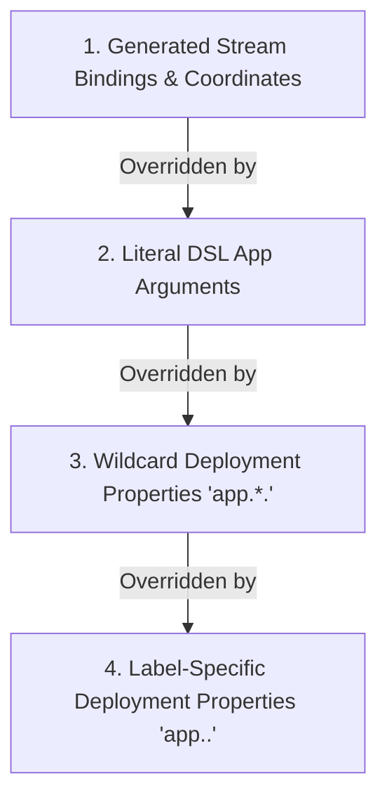

# Stream Deployer: Stream Bindings & Container Arguments Requirements

## 1. Executive Summary & Problem Statement

In Spring Cloud Data Flow (SCDF) and Spring Cloud Skipper, deploying a stream definition (DSL) transforms a high-level messaging topology (such as `time | log`) into individual application specifications equipped with explicit stream binding properties and metadata. These properties configure the underlying Spring Cloud Stream binders (e.g., RabbitMQ, Apache Kafka) at runtime so that microservice containers can:
1. Discover the destinations (exchanges, topics, queues) to which they must publish or subscribe.
2. Form coordinated consumer groups for competing consumer load balancing.
3. Establish required producer groups to ensure downstream queues are bound prior to publishing messages.
4. Identify their stream execution context (stream name, application label, and application type).

In `stream-deployer`, stream definitions are parsed into AST representations (`StreamNode`, `AppNode`, `SourceDestinationNode`, `SinkDestinationNode`). However, `StreamDeployerCore` currently omits all Spring Cloud Stream binding properties and SCDF coordinates when populating application properties. As a direct consequence, `KubernetesResourceGenerator` generates Kubernetes `Deployment` manifests where the container `args` list is either omitted (`null`) or contains only raw user-specified arguments. Deployed containers therefore fail to establish stream communication channels, rendering the deployed stream non-functional.

This document specifies the comprehensive functional and architectural requirements to align `stream-deployer` with SCDF and Skipper stream binding mechanics.

---

## 2. Background: SCDF & Skipper Stream Deployment Mechanics

### 2.1 The Role of Stream Bindings in Spring Cloud Stream

Spring Cloud Stream decouples business logic from messaging middleware through the concept of binder abstractions and logical input/output bindings. By default, applications look for standard binding properties:
- `spring.cloud.stream.bindings.input.destination`: The middleware destination (Kafka topic, RabbitMQ exchange) from which the application consumes.
- `spring.cloud.stream.bindings.input.group`: The consumer group name ensuring point-to-point delivery across scaled instances.
- `spring.cloud.stream.bindings.output.destination`: The middleware destination to which the application produces messages.
- `spring.cloud.stream.bindings.output.producer.requiredGroups`: Comma-separated list of consumer groups for which the binder must pre-provision queues or partitions.

Without these arguments passed via command-line arguments or environment variables, Spring Cloud Stream applications fall back to standalone defaults (such as generating anonymous queues on default destinations), failing to connect to the stream pipeline.

### 2.2 SCDF and Skipper Implementation Analysis

An analysis of `spring-cloud-dataflow` (`spring-cloud-dataflow-core`, `spring-cloud-dataflow-server-core`) and `spring-cloud-skipper` (`spring-cloud-skipper-server-core`) reveals the exact pipeline through which bindings are constructed:

1. **`StreamApplicationDefinitionBuilder` (SCDF Core)**:
   - Takes a `StreamNode` and stream name.
   - Computes application role (`source`, `processor`, `sink`, `app`) based on position and adjacent destination channels.
   - Populates stream coordinate metadata:
     - `spring.cloud.dataflow.stream.name`: The stream name.
     - `spring.cloud.dataflow.stream.app.label`: The unique label of the app in the stream.
     - `spring.cloud.dataflow.stream.app.type`: The calculated application role.
   - Connects adjacent pipeline apps using canonical channel naming: `<streamName>.<upstreamLabel>`.
   - Sets `requiredGroups` on producers to guarantee downstream persistence.
   - Handles named destination channels (`:DEST > app` and `app > :DEST`).
   - Translates DSL content-type arguments (`inputType`, `outputType`).

2. **`SkipperStreamDeployer` & `AppDeploymentRequestFactory` (Skipper Core)**:
   - Aggregates stream application definitions with deployment properties.
   - Resolves deployment properties categorized by wildcard (`app.*.`) and label-specific (`app.<label>.`) keys.
   - Produces `SpringCloudDeployerApplicationSpec` manifests containing application configuration maps.

3. **`KubernetesAppDeployer` & `DefaultContainerFactory` (Spring Cloud Deployer Kubernetes)**:
   - Converts the merged application properties into command-line arguments formatted as `--<key>=<value>`.
   - Injects these arguments into the container specification of the generated Kubernetes `Deployment`.

---

## 3. Current State Analysis in `stream-deployer`

### 3.1 Code Inspection

In `stream-deployer`, the deployment pipeline is orchestrated in `StreamDeployerCore.java`:
```java
StreamNode streamNode = streamParser.parse(stream.getName(), stream.getDsl());
for (AppNode appNode : streamNode.getAppNodes()) {
    String label = appNode.getLabelName();
    String image = metadata.get(appNode.getName());
    Map<String, String> appProperties = new LinkedHashMap<>();
    
    // Only literal arguments from DSL are loaded
    for (ArgumentNode arg : appNode.getArguments()) {
        appProperties.put(arg.getName(), arg.getValue());
    }
    
    // Deployment properties merged
    mergeProperties(appProperties, deploymentProperties, "app." + label + ".");
    mergeProperties(appProperties, deploymentProperties, "app.*.");
    
    // Call Kubernetes resource generator
    ResourceList resources = resourceGenerator.generateResources(
        stream.getName(), label, image, appProperties, appDeploymentProperties);
    ...
}
```

In `KubernetesResourceGenerator.java`:
```java
List<String> args = null;
if (!appProperties.isEmpty()) {
    args = new ArrayList<>();
    appProperties.entrySet().stream()
            .sorted(Map.Entry.comparingByKey())
            .forEach(e -> args.add("--" + e.getKey() + "=" + e.getValue()));
}
```

### 3.2 Existing Deficiencies

1. **Omission of Stream Bindings**: `StreamDeployerCore` does not calculate input or output destinations, consumer groups, or producer required groups.
2. **Omission of Stream Metadata**: SCDF metadata properties (`spring.cloud.dataflow.stream.*`) are never added to `appProperties`.
3. **Empty Container Arguments**: For standard streams without literal arguments (e.g., `time | log`), `appProperties` is empty. Consequently, `args` evaluates to `null`, resulting in YAML manifests with no container `args`.
4. **Unsupported Content-Type Arguments**: Literal arguments like `--inputType` and `--outputType` are passed literally rather than translated into Spring Cloud Stream content-type properties.
5. **No Named Destination Routing**: Streams utilizing `:DEST > log` or `time > :DEST` generate containers with no knowledge of the external destination name.

### 3.3 Current Manifest Output (`time-logger.yaml`)
```yaml
apiVersion: apps/v1
kind: Deployment
metadata:
  name: time-logger-time
spec:
  replicas: 1
  selector:
    matchLabels:
      app: time-logger-time
  template:
    metadata:
      labels:
        app: time-logger-time
    spec:
      containers:
      - image: springcloudstream/time-source-rabbit:main
        name: time-logger-time
        # MISSING: args block is null/omitted!
```

---

## 4. Functional Requirements

### 4.1 Stream Coordinate Metadata Generation

For every `AppNode` in a parsed `StreamNode`, the following properties must be generated:
- `spring.cloud.dataflow.stream.name`: Value must equal the stream definition name.
- `spring.cloud.dataflow.stream.app.label`: Value must equal `appNode.getLabelName()`.
- `spring.cloud.dataflow.stream.app.type`: Value must reflect the computed application role (`source`, `processor`, `sink`, or `app`).

### 4.2 Application Role Determination

The role (`AppType`) of an application node must be determined as follows:
1. **Unbound Stream App**:
   - If `appNode.isUnboundStreamApp()` is `true` (e.g., single app without pipes or channels): `app`.
2. **First Application (`index == 0`)**:
   - If no `SourceDestinationNode` is present: `source`.
   - If `SourceDestinationNode` is present and only one `AppNode` exists without a `SinkDestinationNode`: `sink`.
   - If `SourceDestinationNode` is present and followed by additional apps or a `SinkDestinationNode`: `processor`.
3. **Subsequent Applications (`index > 0`)**:
   - If the application is not the last app in `streamNode.getAppNodes()`: `processor`.
   - If the application is the last app in `streamNode.getAppNodes()` and a `SinkDestinationNode` is present: `processor`.
   - If the application is the last app in `streamNode.getAppNodes()` and no `SinkDestinationNode` is present: `sink`.

### 4.3 Pipeline Binding Resolution (Linear Streams)

For standard linear pipelines (e.g., `app1 | app2 | app3`):
- **Output Destination** (for `source` and `processor` apps):
  - `spring.cloud.stream.bindings.output.destination = <streamName>.<currentAppLabel>`
  - `spring.cloud.stream.bindings.output.producer.requiredGroups = <streamName>`
- **Input Destination** (for `processor` and `sink` apps):
  - `spring.cloud.stream.bindings.input.destination = <streamName>.<upstreamAppLabel>`
  - `spring.cloud.stream.bindings.input.group = <streamName>`

### 4.4 Named Destination Channels

1. **Sink Destination Channel (`app > :DEST`)**:
   - The upstream application produces to the named destination:
     - `spring.cloud.stream.bindings.output.destination = <DEST>`
   - `requiredGroups` must NOT be generated by default for named destinations (matching SCDF convention where destinations are managed externally).

2. **Source Destination Channel (`:DEST > app`)**:
   - The downstream application consumes from the named destination:
     - `spring.cloud.stream.bindings.input.destination = <DEST>`
     - `spring.cloud.stream.bindings.input.group = <streamName>` (default)
   - If an explicit `--group=<val>` argument is specified on the `SourceDestinationNode` (e.g., `:DEST --group=custom_group > app`):
     - `spring.cloud.stream.bindings.input.group = <val>`

### 4.5 Content-Type Argument Translation

When literal DSL arguments `--inputType` or `--outputType` are defined on an `AppNode`:
- `--inputType=<mime>` must be translated to:
  `spring.cloud.stream.bindings.input.contentType = <mime>`
- `--outputType=<mime>` must be translated to:
  `spring.cloud.stream.bindings.output.contentType = <mime>`
- Both `inputType` and `outputType` must be removed from literal application arguments to avoid redundant or conflicting arguments passed to the container.

### 4.6 Property Precedence & Override Hierarchy

Container properties must be resolved according to a strict precedence hierarchy (from lowest to highest precedence):



1. **Generated Stream Bindings & Coordinates (Lowest Precedence)**: Default binding properties computed by `StreamBindingResolver`.
2. **Literal DSL App Arguments**: User arguments defined on the node in the stream DSL (e.g., `time --fixed-delay=5`).
3. **Wildcard Deployment Properties**: Properties prefixed with `app.*.` passed in the properties file or CLI `--properties`.
4. **Label-Specific Deployment Properties (Highest Precedence)**: Properties prefixed with `app.<label>.` passed in the properties file or CLI `--properties`.

*Example*: If the resolver generates `spring.cloud.stream.bindings.input.group=time-logger`, but deployment properties supply `app.log.spring.cloud.stream.bindings.input.group=custom-group`, the final container argument must be `--spring.cloud.stream.bindings.input.group=custom-group`.

---

## 5. YAML Manifest Comparison

### 5.1 Linear Pipeline (`time | log` in stream `time-logger`)

#### Current Output (Deficient)
```yaml
apiVersion: apps/v1
kind: Deployment
metadata:
  name: time-logger-time
spec:
  replicas: 1
  template:
    spec:
      containers:
      - name: time-logger-time
        image: springcloudstream/time-source-rabbit:main
        # args is omitted / null
```

#### Required Output
```yaml
apiVersion: apps/v1
kind: Deployment
metadata:
  name: time-logger-time
spec:
  replicas: 1
  template:
    spec:
      containers:
      - name: time-logger-time
        image: springcloudstream/time-source-rabbit:main
        args:
        - "--spring.cloud.dataflow.stream.app.label=time"
        - "--spring.cloud.dataflow.stream.app.type=source"
        - "--spring.cloud.dataflow.stream.name=time-logger"
        - "--spring.cloud.stream.bindings.output.destination=time-logger.time"
        - "--spring.cloud.stream.bindings.output.producer.requiredGroups=time-logger"
---
apiVersion: apps/v1
kind: Deployment
metadata:
  name: time-logger-log
spec:
  replicas: 1
  template:
    spec:
      containers:
      - name: time-logger-log
        image: springcloudstream/log-sink-rabbit:main
        args:
        - "--spring.cloud.dataflow.stream.app.label=log"
        - "--spring.cloud.dataflow.stream.app.type=sink"
        - "--spring.cloud.dataflow.stream.name=time-logger"
        - "--spring.cloud.stream.bindings.input.destination=time-logger.time"
        - "--spring.cloud.stream.bindings.input.group=time-logger"
```

### 5.2 Source to Named Destination (`time > :TIME_LOG` in stream `time-publisher`)

#### Required Output for `time`
```yaml
containers:
- name: time-publisher-time
  image: springcloudstream/time-source-rabbit:main
  args:
  - "--spring.cloud.dataflow.stream.app.label=time"
  - "--spring.cloud.dataflow.stream.app.type=source"
  - "--spring.cloud.dataflow.stream.name=time-publisher"
  - "--spring.cloud.stream.bindings.output.destination=TIME_LOG"
```

### 5.3 Named Destination to Sink (`:TIME_LOG > log` in stream `publish-logs`)

#### Required Output for `log`
```yaml
containers:
- name: publish-logs-log
  image: springcloudstream/log-sink-rabbit:main
  args:
  - "--spring.cloud.dataflow.stream.app.label=log"
  - "--spring.cloud.dataflow.stream.app.type=sink"
  - "--spring.cloud.dataflow.stream.name=publish-logs"
  - "--spring.cloud.stream.bindings.input.destination=TIME_LOG"
  - "--spring.cloud.stream.bindings.input.group=publish-logs"
```

---

## 6. Non-Functional Requirements

1. **Deterministic Manifest Generation**: Container arguments in the generated Kubernetes YAML must be sorted lexicographically by argument key (e.g., `Map.Entry.comparingByKey()`). This ensures idempotent, diff-friendly manifest updates.
2. **Null Safety**: Methods resolving arguments, nodes, and destinations must guard against null references. Unbound arguments or collections must default to empty maps rather than throwing `NullPointerException`. All non-primitive getters must follow the `@Nullable` guideline.
3. **Logging**: All internal diagnostic or debug logging must strictly use `java.util.logging.Logger` in accordance with repository standards.
4. **Performance**: Binding resolution must operate entirely in-memory using the parsed AST (`StreamNode`) without blocking I/O or external network lookups.

---

## 7. Acceptance Criteria

- [x] **AC-1**: Comprehensive `requirements.md` exists in the repository root detailing background, current state, functional requirements, and YAML comparisons.
- [ ] **AC-2**: Linear stream `time | log` generates Kubernetes deployment containers containing stream coordinates, `output.destination=time-logger.time`, `output.producer.requiredGroups=time-logger`, `input.destination=time-logger.time`, and `input.group=time-logger`.
- [ ] **AC-3**: Source to named destination `time > :DEST` generates `output.destination=DEST` without default `requiredGroups`.
- [ ] **AC-4**: Named destination to sink `:DEST > log` generates `input.destination=DEST` and `input.group=<streamName>` (or explicit `--group` value).
- [ ] **AC-5**: Three-tier pipeline `http | transform | log` correctly assigns `source`, `processor`, and `sink` app types and binds intermediate topics (`multi-step.http`, `multi-step.transform`).
- [ ] **AC-6**: DSL arguments `--inputType` and `--outputType` are translated to `spring.cloud.stream.bindings.*.contentType` and stripped from raw container args.
- [ ] **AC-7**: User deployment properties passed in `--properties` override generated stream bindings while preserving non-overridden defaults.
- [ ] **AC-8**: All container arguments are formatted as `--<key>=<value>` and sorted alphabetically.
